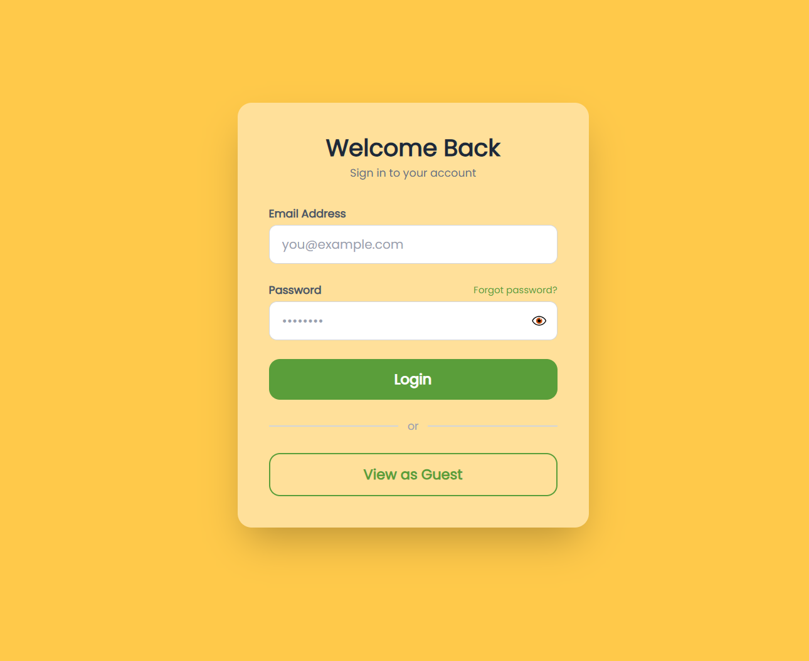
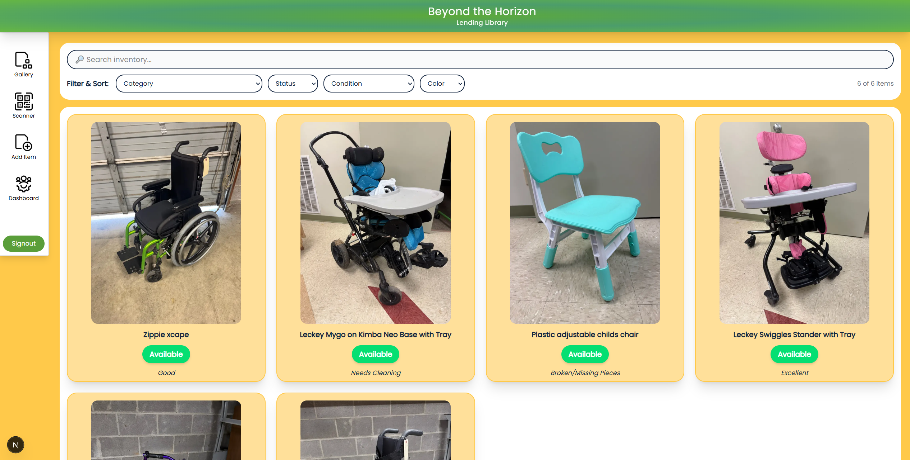
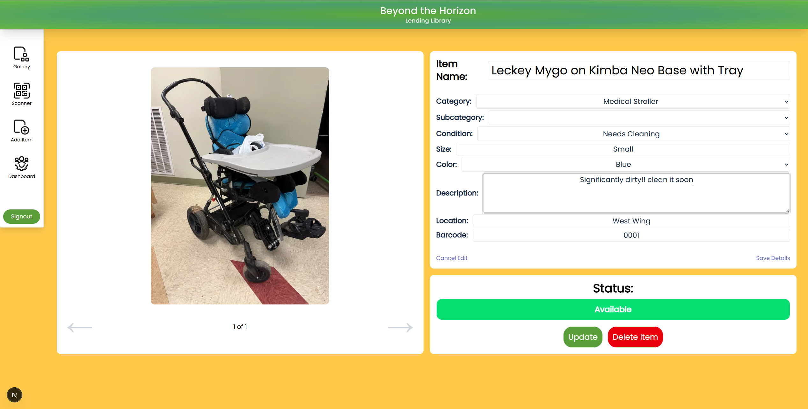
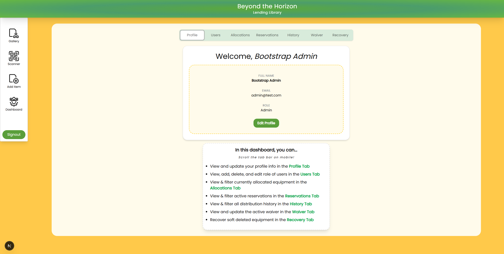
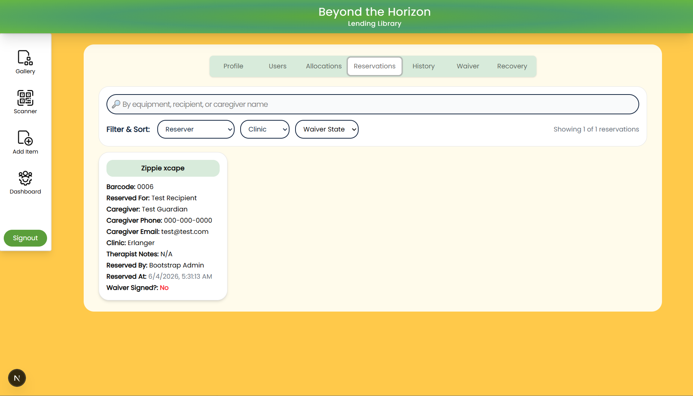
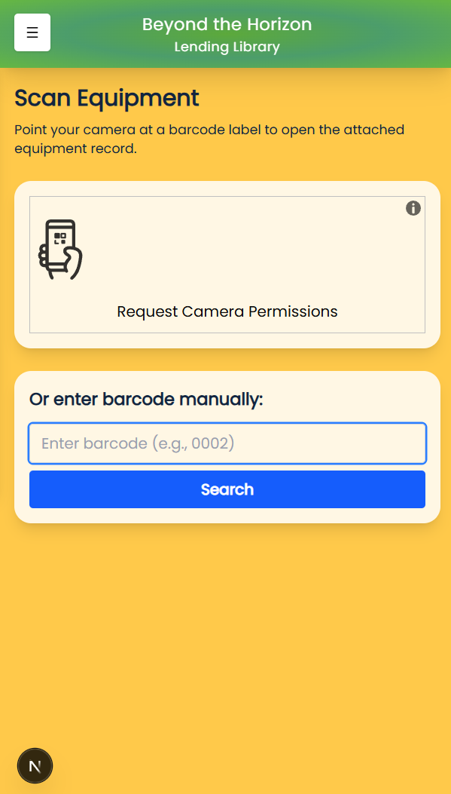
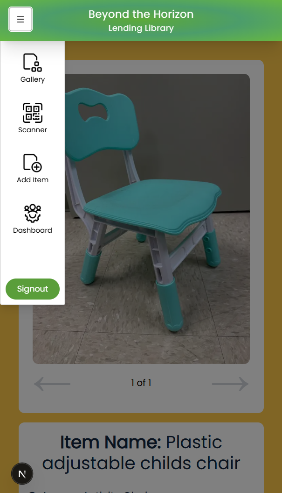
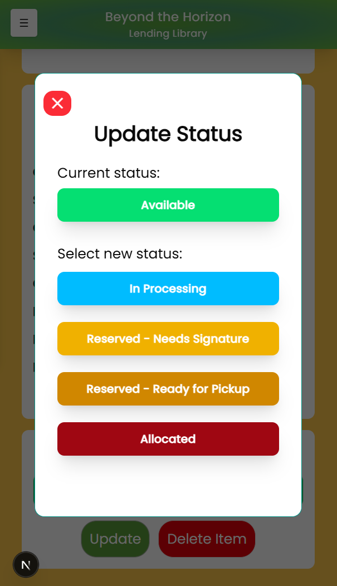

# Beyond the Horizon Lending Library Overview
A cloud-based inventory system for managing donated pediatric adaptive equipment. This system allows physical therapists and volunteers to search and filter equipment, track donations, allocate items to families, and manage/audit inventory across organizations.

## Project Purpose 
This project is intended for use by Erlanger and Siskin Hospitals to support sustainable community reuse of pediatric adaptive equipment at no cost to recipients. 
The goal is to help physical therapists and trained volunteers at these organizations keep track of equipment, including functionalities to check it in/out via barcode scanning and update its condition, availability, and description.  

## Key Features
- Searchable and filterable equipment inventory
- Photo uploads of each item
- Editable equipment fields (descriptions, conditions, sizes, etc.)
- Bar Code scanning for quick look-up
- Equipment Reservation System
- Fully embedded waiver signing workflow
- Status tracking (available, allocated, awaiting signature, and ready for pickup)
- Complete auditing of distribution history
- Multi-organization, role-based access for admins, therapists, and volunteers

## Tech Stack
Frontend:
- Next.js
- Tailwind CSS

Backend:
- Supabase (PostgreSQL database)
- Supabase Authentication

Infrastructure:
- Github (version control)
- Vercel (hosting & deployment)

## Screenshots

## Login Page and Gallery

<div align="center">
  
  
</div>

## Editing Equipment


## Profiles and Auditing
<div align="center">
  
  
</div>


## Mobile Look
<div align="center">
  
  
  
</div>


## Installation  

### Prerequisites

1. You will need Docker Desktop to create your own local Supabase instance.
If you do not have it, please install at: 
> https://www.docker.com/products/docker-desktop/
> 
Ensure Docker is running before proceeding.

2. You will need to install Node.js
If you do not have it, please install:
> https://nodejs.org/ 
>
After installing, verify:

```bash
node -v

npm -v
```

## Project Structure

The project consists of two parts: 

> Frontend (Next.js): Located in pediatric-equipment-exchange/ 

> Backend (Supabase via Docker): Managed from the root folder using Supabase CLI

Database tables and schema are automatically generated from the supabase/migrations folder.
In case of emergency: reset the database with

```bash
npx supabase db reset
```

## Setup Guide 

1. Clone the repository 

```bash

git clone https://github.com/macCon6/Pediatric-Equipment-Exchange.git 

```

2. Start the Local Supabase Instance

Verify that Docker is running and start Supabase from the repository root:

```bash

cd Pediatric-Equipment-Exchange
npx supabase start

```

3. Configure environment variables

Create a .env.local file inside the frontend directory:

pediatric-equipment-exchange/.env.local

Copy and paste the environment variables that show under “Authentication Keys” section of the terminal output. See .env.example for an example.


4. Open a new terminal

Navigate to the frontend application directory: 

```bash
cd pediatric-equipment-exchange
```

5. Install Dependencies & seed the database

``` bash
npm install

npm run bootstrap
```

6. Start the development server

``` bash
npm run dev
```

7. Visit the website

- Navigate to http://localhost:3000/ to see our website

- Navigate to http://localhost:54323/ for optional viewing of our database schema using the Supabase UI


The bootstrap script automatically creates a new user that you can log in as. If you do not wish to view as a guest, please navigate to the login page and input the account with your desired role:

> Email: admin@test.com
> Password: admin123

> Email: therapist@test.com
> Password: ther123

> Email: volunteer@test.com
> Password: vol123


### Stopping the local environment

When finished, stop the local Supabase instance with

```bash
npx supabase stop
```


